# Lab 1

## SED

### Q.1: Display the lines that contain the word "lp" in `/etc/passwd` file?

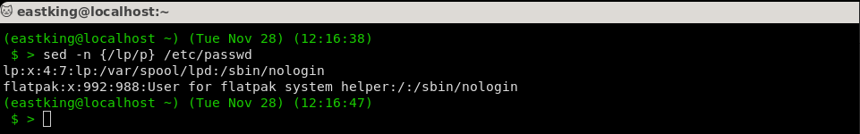

### Q.2: Display `/etc/passwd` file except the 3rd line?

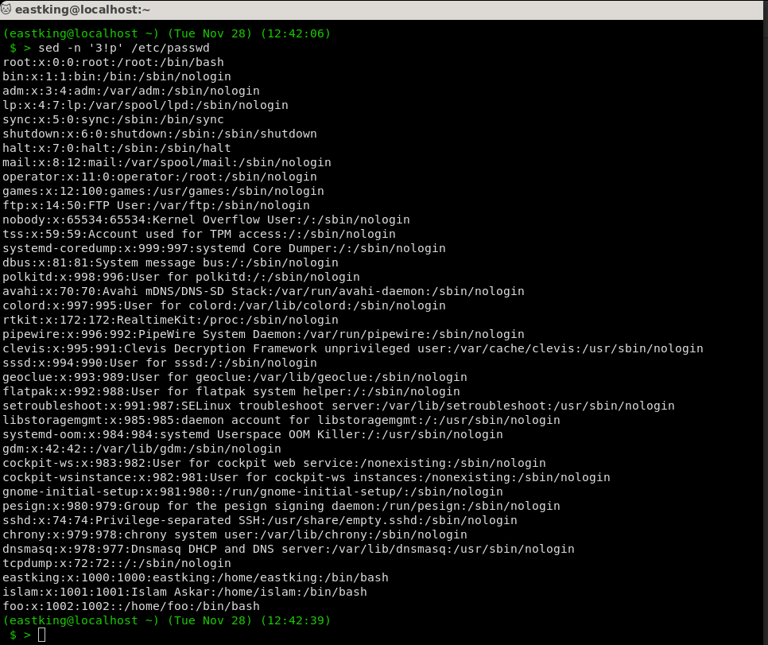

### Q.3: Display `/etc/passwd` file except the last line?

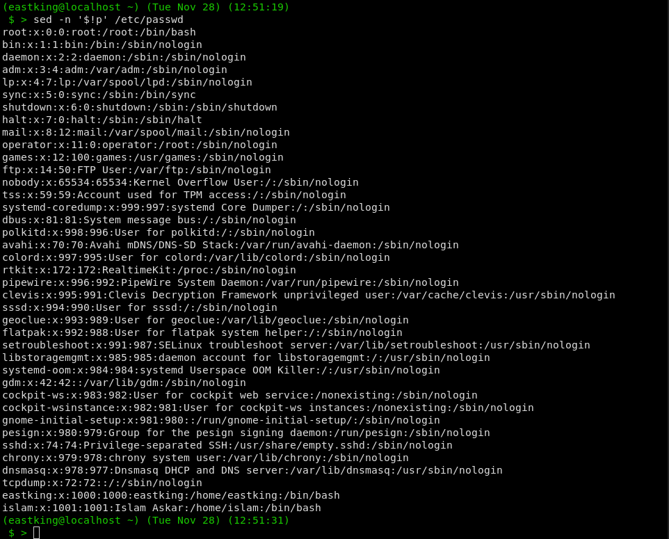

### Q.4: Display `/etc/passwd` file except the lines that contain the word `lp`?

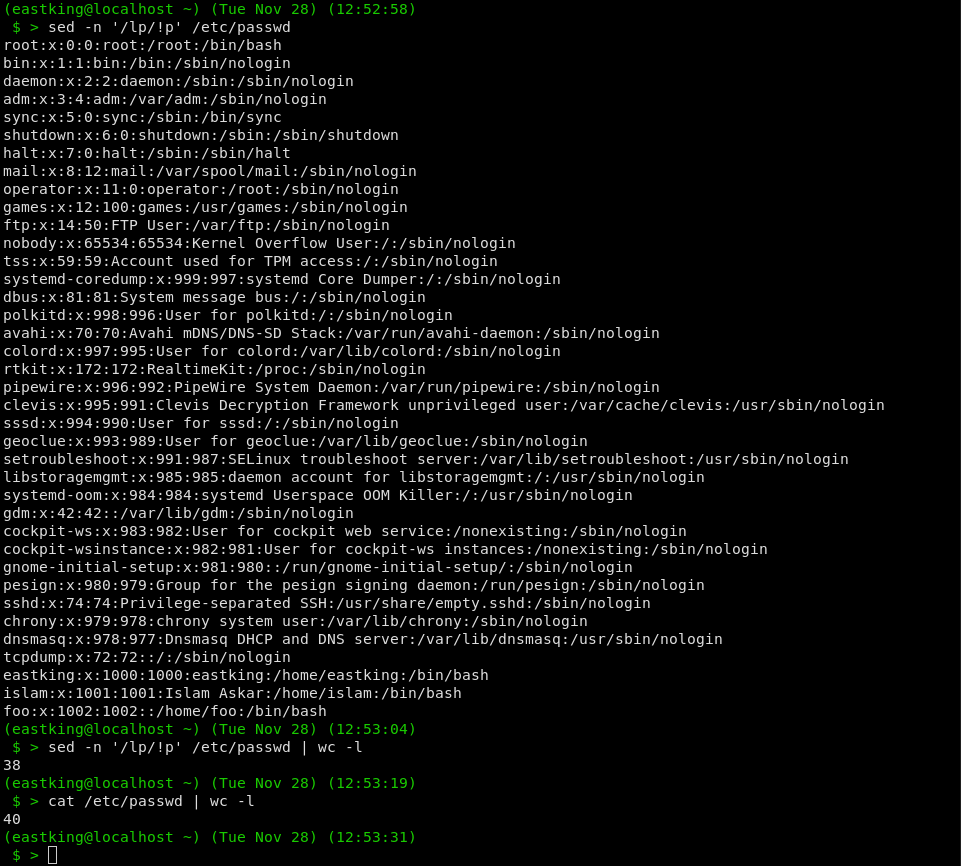

### Q.5: Substitute all the words that contain `lp` with `mylp` in `/etc/passwd` file?

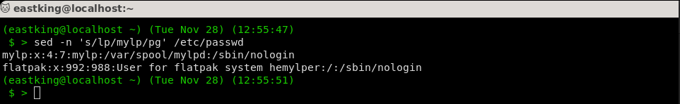

## AWK

### Q.1: Print full name (comment) of all users in the system?

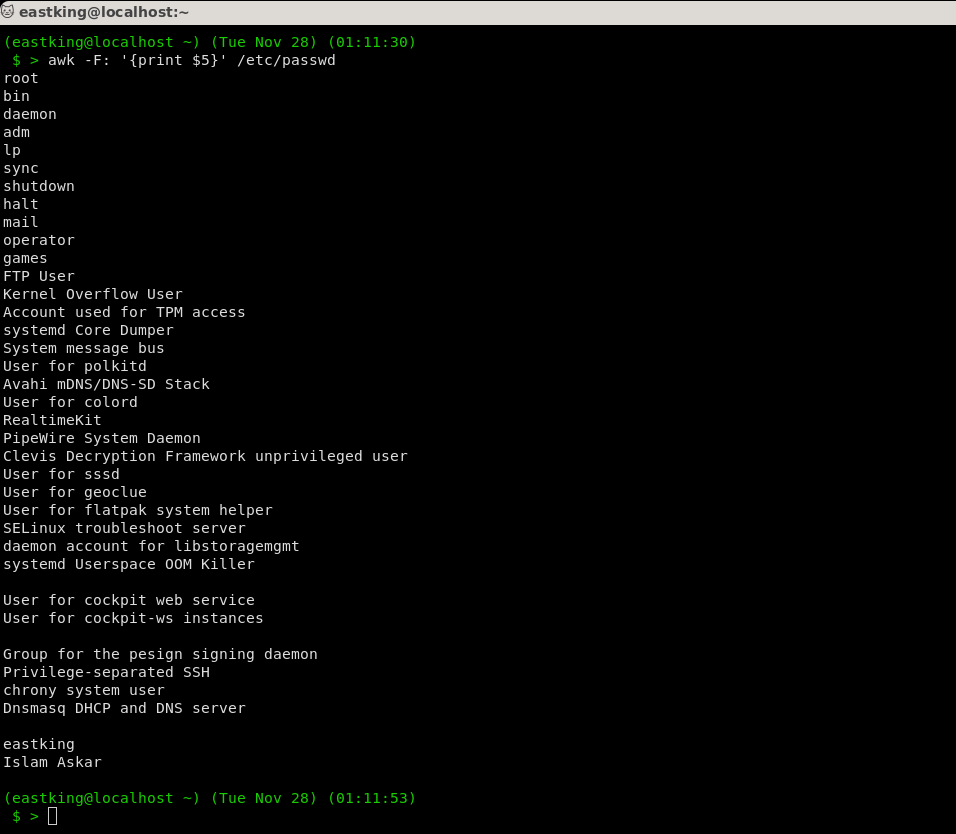

### Q.2: Print login, full name(comment) and home directory of all users?(precede each line with line number)

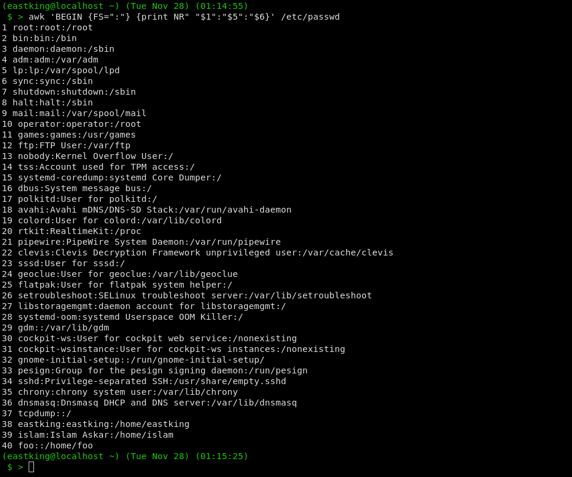

### Q.3: Print long, `uid` and fullname (comment) of those `uid` greater than 500?

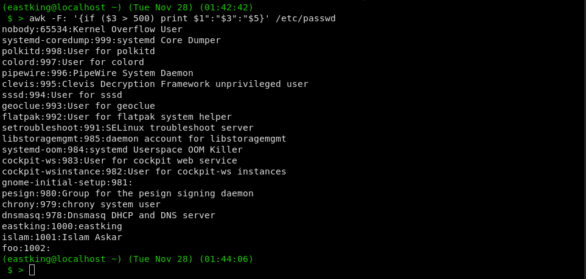

### Q.4: Print login, `uid` and fullname (comment) of those uid exactly equal to 500?

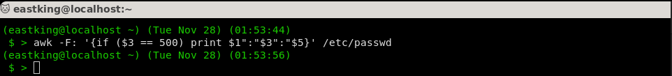

### Q.5: Print line from 5 to 15 from `/etc/passwd` file?

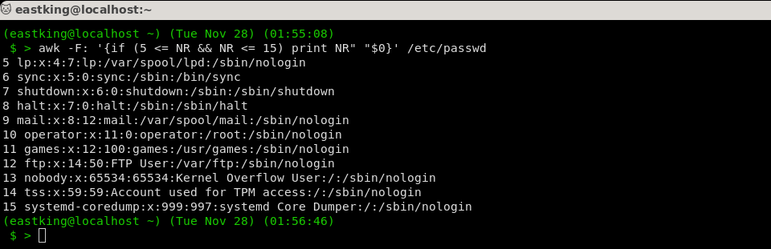

### Q.6: Change `lp` to `mylp`?

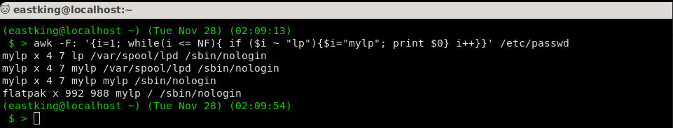

### Q.7: Print all information about greatest `uid`?

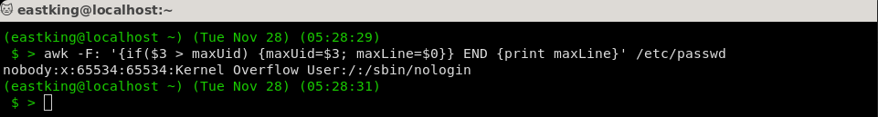

### Q.8: Get the sum of all accounts id's?

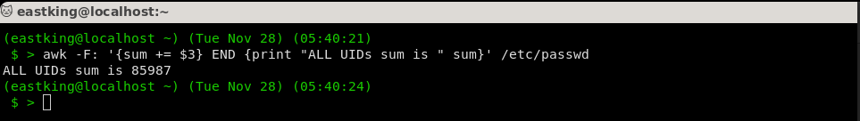

## Bonus

### Q.1

```bash
sort -t: -k4 -n /etc/passwd | awk -F: 'BEGIN {curGrp=0; sumId=0} {if ($4 != curGrp) {if (NR > 0) {print "Group ["curGrp"]\t"sumId}; sumId =0; curGrp=$4} sumId += $3} END {print "Group ["curGrp"]\t"sumId}'
```
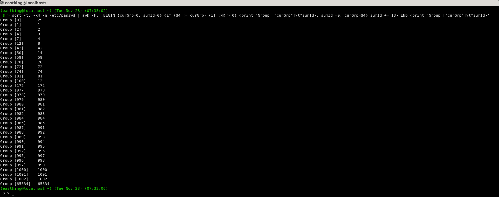

### Q.2

```bash
sort -t: -k4 -n /etc/passwd | awk -F: ' BEGIN {curGrp = -1}
{if (curGrp != $4)
{ curGrp = $4;
cmd = "getent group " curGrp " | cut -d: -f1";
cmd | getline grpName;
close(cmd);
print "\nGroup [" grpName "]";
}
{print $1}
}'
```
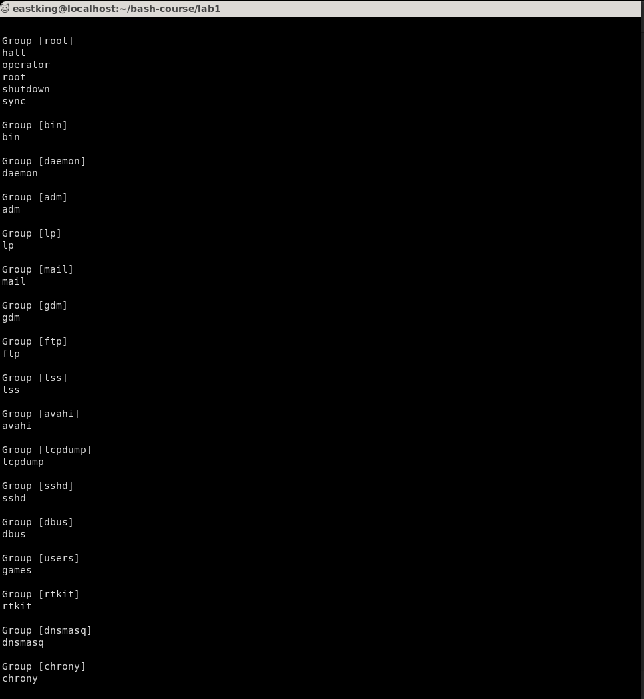
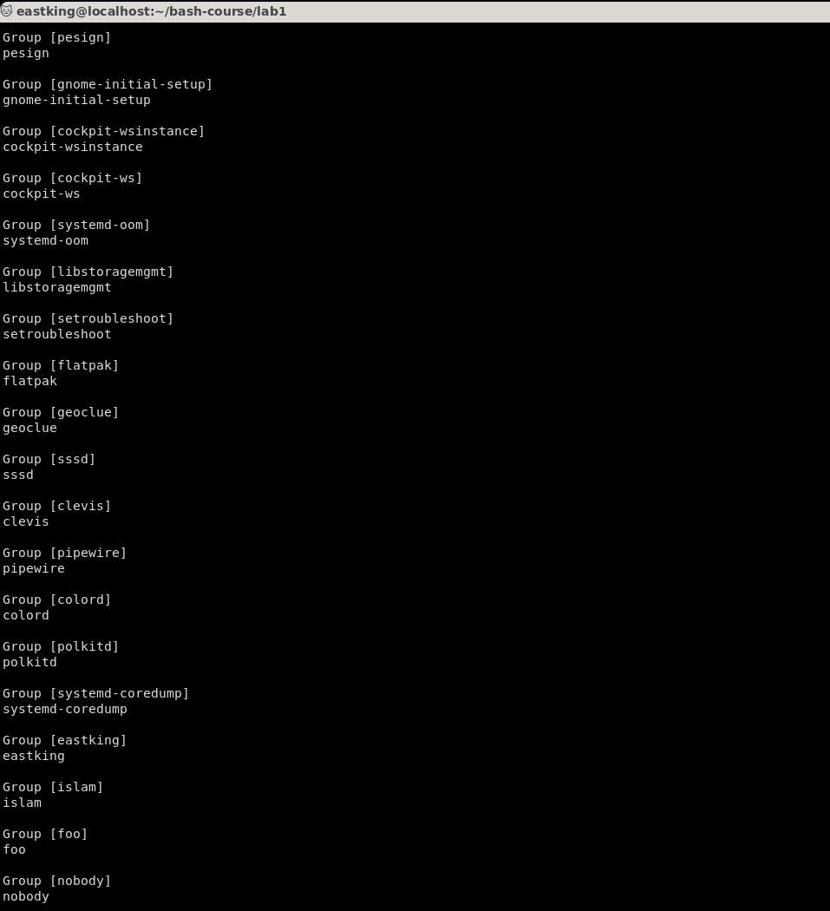

