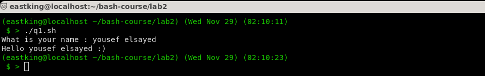
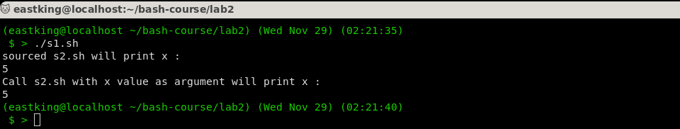
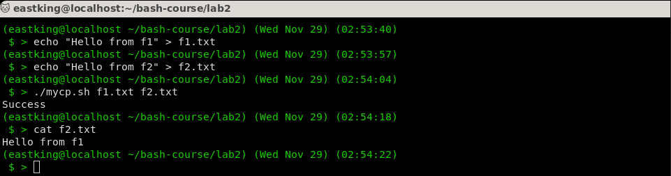
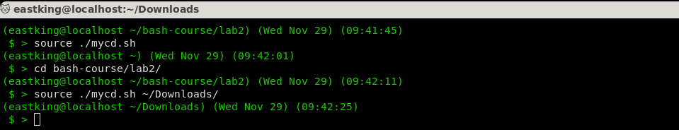
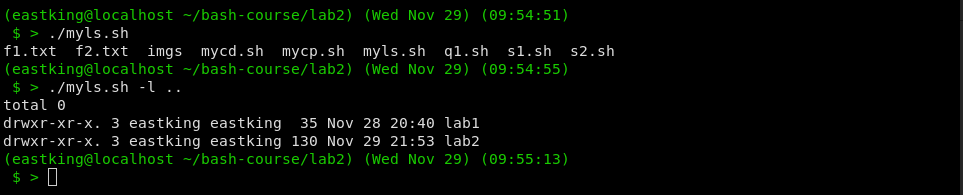
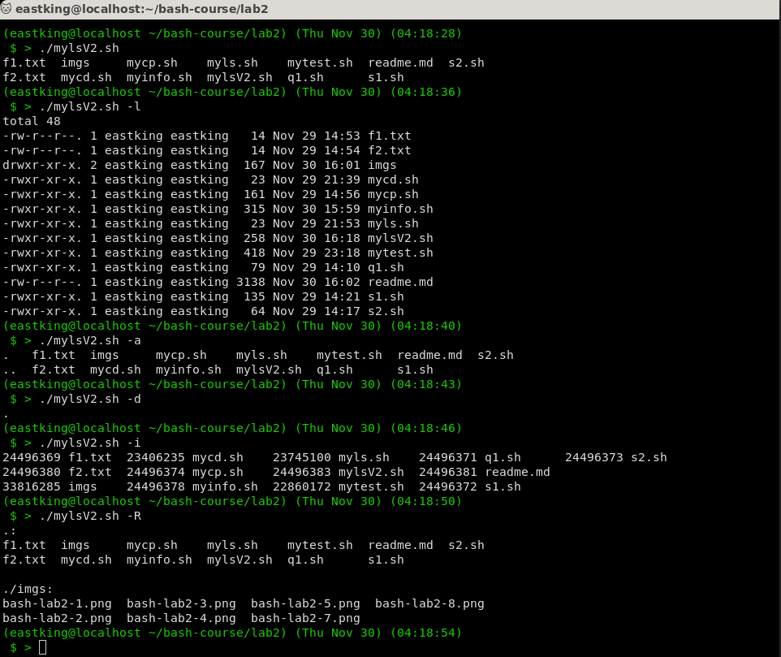
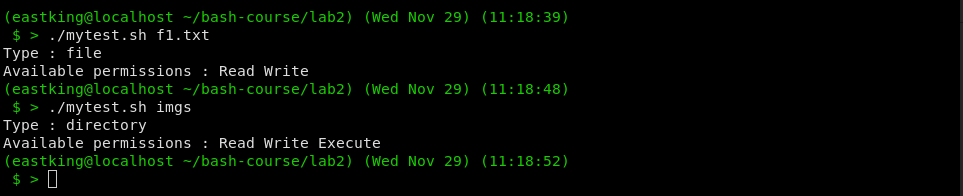
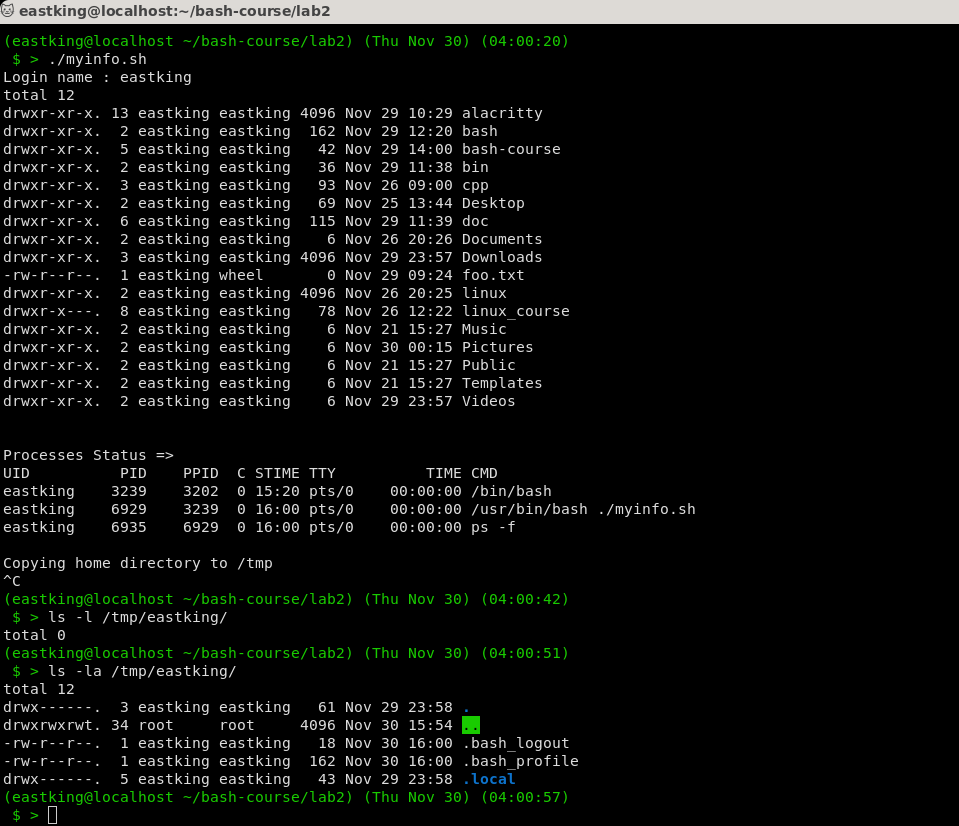

# Bash Lab 2

## Q.1: Create a script that asks for user name then send a greeting to him?

```bash
#!/usr/bin/bash

read -p "What is your name : " -r name

echo "Hello $name :)"
```



## Q.2: Create a script calles `s1` that calls another script `s2` where

1. In `s1` there is a variable called `x`, its value is `5`

    ```bash
    #!/usr/bin/bash

    x=5
    echo "sourced s2.sh will print x :"
    . s2.sh

    echo "Call s2.sh with x value as argument will print x :"
    ./s2.sh $x
    ```
  
1. Try to print the value of `x` in `s2` by 2 different ways

    ```bash
    #!/usr/bin/bash

    if (( $# == 0))
    then
      echo $x
    else
      echo $1
    fi
    ```



## Q.3: Create a script called `mycp` where

1. **It copies a file to another**

1. **It copies mutliple files to a director**

```bash
#!/usr/bin/bash

[ $# = 0 ] && { echo "At least 2 arguemnts needed source and destination"; exit 1; }

cp $@

(( $? == 0 )) && echo "Success" || echo "Fail"
```



## Q.4: Create a scrip called `mycd` where

1. **It change directory to the user home director, if it's called withou arguments.**

1. **Otherwise, it lists the given directory**

```bash
#!/usr/bin/bash

cd $@
```



## Q.5: Create a script called `myls` where

1. **It lists the current directory, if it's called withou arguments**

1. **Otherwise, it lists the given director**

```bash
#!/usr/bin/bash

ls $@
```



## Q.6: Enhance the above script to support the following options individually

1. `-l` lists in long format
1. `-a` list all entries including the hiding files
1. `-d` if an argument is a director, list only its name
1. `-i` print `inode` number
1. `-R` Recursively list subdirectories

```bash
#!/usr/bin/bash

# ${@:2} expand to all arguments except the 1st one
[ "$1" = '-l' ] && { ls -l "${@:2}"; exit 0; }
[ "$1" = '-a' ] && { ls -a "${@:2}"; exit 0; }
[ "$1" = '-d' ] && { ls -d "${@:2}"; exit 0; }
[ "$1" = '-R' ] && { ls -R "${@:2}"; exit 0; }

ls "$@"
```



## Q.7: Create a script called `mytest` where

1. **It checkthe type of the given argument (file/directory)**
1. **It check the permissiosn of the given argument (read/write/execute)**

```bash
#!/usr/bin/bash

# Input Validation
[ $# -ne 1 ] { echo "Usage: 1 argument required"; exit 1; }

[ ! -e $1 ] { echo "Not a valid File or Directory"; exit 1; }

# Actual Logic
# -n is prevent trailing \n
echo -n "Type : "

[ -f $1 ] && echo "file";
[ -d $1 ] && echo "directory";

echo -n "Available permissions : "

[ -r $1 ] && echo -n "Read";
[ -w $1 ] && echo -n " Write";
[ -x $1 ] && echo -n " Execute";

echo 
```



## Q.8: Create a script called `myinfo` where

1. **It asks the user about his/her login name**
1. **It prints full info about files and directories in his/her home directory**
1. **Copy his/her files and directories as much as you can in `/tmp` directory**
1. **Get his current processes status**

```bash
#!/usr/bin/bash

read -p "Login name : " loginName;
homeDir="/home/$loginName"

if [ -e $homeDir ]
then
 ls -l $homeDir

  echo -e "\n\nProcesses Status =>"
  ps -f
  echo -e "\nCopying home directory to /tmp"
  cp -r $homeDir /tmp
  echo "Finished copying"

else
 echo "No Home Directory for this user"
 exit 1
fi
```


