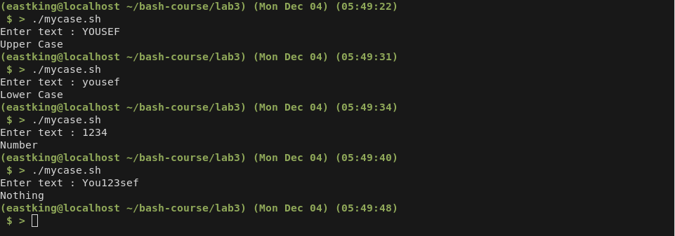

# Lab 3

## Q.1: Write script `mycase` , using the `case` utility to check the type of character entered by user?

* Script should print the following:
    1. upper Case
    1. Lower Case
    1. Number
    1. Nothing

* Solution:

    ```bash
    #!/usr/bin/bash

    shopt -s extglob
    export LC_COLLATE=C

    read -p "Enter text : " text

    case $text in
    +([A-Z]))
    echo "Upper Case"
    ;;

    +([a-z]))
    echo "Lower Case"
    ;;

    +([0-9]))
    echo "Number"
    ;;

    +([a-zA-Z0-9]))
    echo "Mix"
    ;;

    *)
    echo "Nothing"
    ;;
    esac
    ```

* Output

    

## Q.2: Enhance previous script, by checking the type of string entered by a user?

* The script should print the following
    1. Upper Case
    1. Lower CAse
    1. Number
    1. Mix
    1. Nothing

* Solution

    ```bash
    #!/usr/bin/bash

    shopt -s extglob
    export LC_COLLATE=C

    read -p "Enter text : " text

    case $text in
    +([A-Z]))
    echo "Upper Case"
    ;;

    +([a-z]))
    echo "Lower Case"
    ;;

    +([0-9]))
    echo "Number"
    ;;

    *)
    echo "Nothing"
    ;;
    esac
    ```

* Output

    

## Q.3: Write a script `mychmod` using `for` utility to create a backup of only files in your home directory?

* Solution

    ```bash
    #!/usr/bin/bash

    cd ~

    for file in *
      do
        chmod +x $file
      done
      ```

* Output

    

## Q.4: Write script `mybackup` using `for` utility to create a backup of only filex in your home directory?

* Solution

    ```bash
    #!/usr/bin/bash

    cd ~

    for file in *
    do
      if [[ -f $file ]]
        then
          cp $file "$file.bak"
          echo "Backed up $file Successfully"
      fi
    done
    ```

* Output

    

## Q.5: Write script `mymail` using `for` utility to send mail to all users in the system?

* Solution

    ```bash
    #!/usr/bin/bash

    for user in $(cut -d: -f1 /etc/passwd)
    do
      if [[ -d "/home/$user/" ]]
        then
          mail -s "Testing Mail" $user < mtemplate
          status=$?
          echo -n "Sending mail to $user was "

          if [[ $status == 0 ]]
          then
            echo "success"
          else
            echo "failed"
          fi
      fi
    done
    ```

* Output

    

## Q.6: Write script `chkmail` to check for new mails every 10 seconds?

* Solution
  
  ```bash
  #!/usr/bin/bash

  ((lines=0))

  while true
  do
    newLines=$(cat "/var/mail/$USER" | wc -l)
    if [[ $newLines > $lines ]]; then
      echo "You've Got Mail"
      lines=$newLines
    fi
    sleep 10s
  done
  ```

* Output
  
  

## Q.7: What is the output of the given script?

```bash
1
```

## Q.8: Create the following menu?

* Menu should include the following
    1. Press 1 to `ls`
    1. Press 2 to `ls -a`
    1. Press 3 to `exit`

* Solution

    ```bash
    #!/usr/bin/bash

    select choice in 'ls' 'ls -a' 'exit'
    do
    case $choice in
    'ls')
    ls
    ;;

    'ls -a')
    ls -a
    ;;

    'exit')
    break
    ;;

    *)
    echo "Invalid Choice"
    ;;

    esac
    done
    ```

* Output

    

## Q.9: Write script `myarr` that asks the user how many element he wants in an array, fill the array and then print it?

* Solution

    ```bash
    #!/usr/bin/bash

    read -p "Number of array elements : " size

    # Input Validation
    if [[ ! $size =~ ^[0-9]+$ ]]
      then
      echo "Input must be a positive integer"
      exit 1
    fi

    for (( i = 0; i < $size; ++i ))
    do
      read -p "Element no. $((i+1)) "  arr[$i]
    done

    echo ${arr[@]}
    ```

* Output

    

## Q.10: Write script `myavg` that calculate average of all number enterd by a user?

* Solution

    ```bash
    #!/usr/bin/bash

    read -p "Array Size : " size

    # Input Validation
    if [[ ! $size =~ ^[0-9]+$ ]]
      then
      echo "Input must be a positive integer"
      exit 1
    fi

    sum=0
    for (( i = 0; i < $size; ++i ))
    do
      read -p "Element no. $((i+1)) " value

      if [[ ! $value =~ ^[0-9]+$ ]]
        then
        echo "Input must be a positive integer"
        exit 1
      fi
      ((sum += $value))
      arr[i]=$value
    done

    echo $(( sum / ${#arr[@]} ))
    ```

* Output

    

## Q.11: Write a function `mysq` that calculate square of its argument?

* Solution

    ```bash
    #!/usr/bin/bash

    if [[ $# != 1 ]]
      then
      echo "Program takes only 1 argument"
      exit 1
    fi

    function square
    {
      ((res = $1 * $1 ))
      echo $res;
    }

    square $1
    ```

* Output

    
